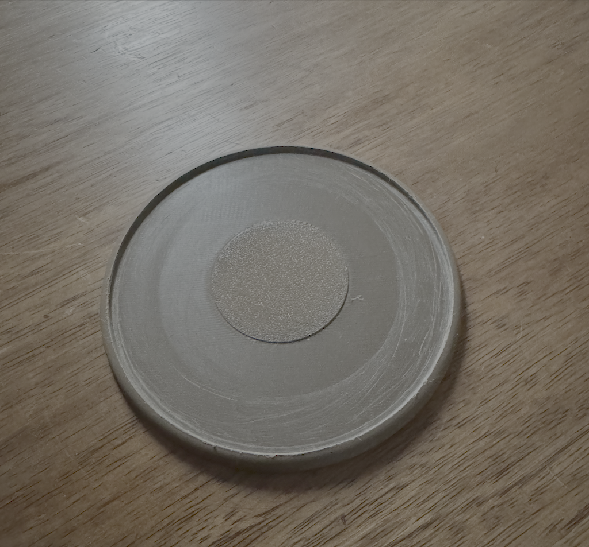

# 3d-prints

A collection of models for 3D printing different objects that have been useful to me.  

Some are pretty specific to my needs and will probably be of no interest to others.  
Some should be pretty generic and hopefully will be helpful to others.  

All the models have been made with [Cadova: Swift DSL for parametric 3D modeling](https://github.com/tomasf/Cadova),
but I also included the generated 3mf file so people without a Swift toolchain can benefit.  

# Models

## table-cap

A very specific item I made to attach the top of an old pedestal table to the base.  
In addition, I included a small edge so the bedside lamp would stay in the center of the table.  
I printed this on a BambuLab P1S with wood filament.  
I did not do any postprocessing and the result looks very much like brown plastic and not wood.  

