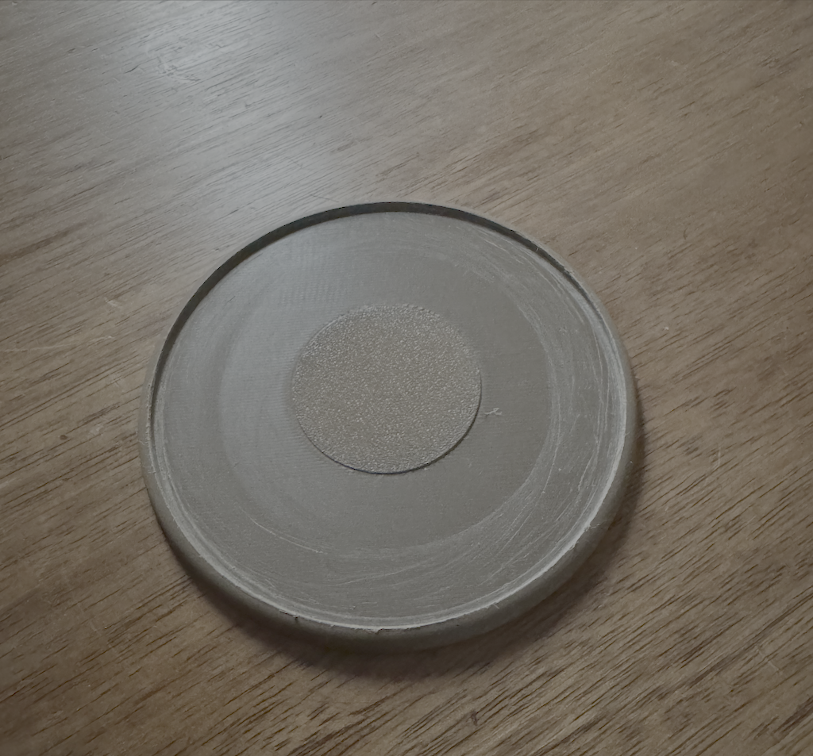
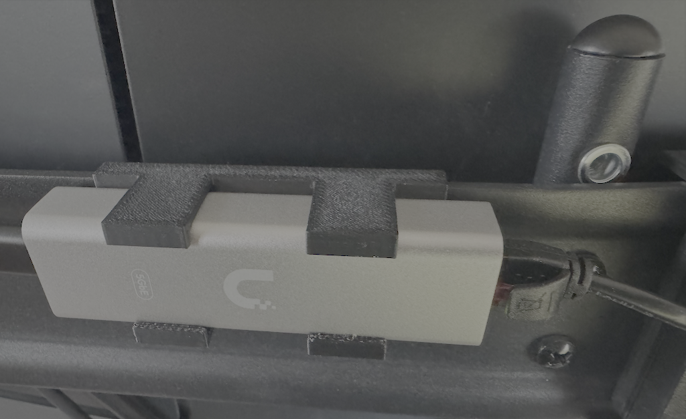
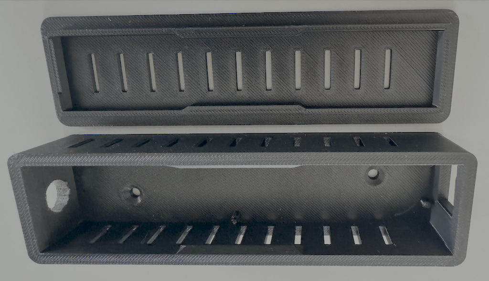
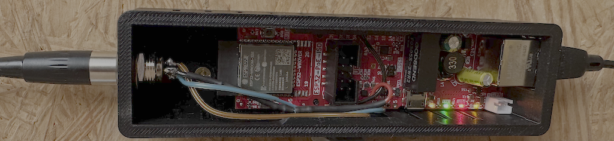
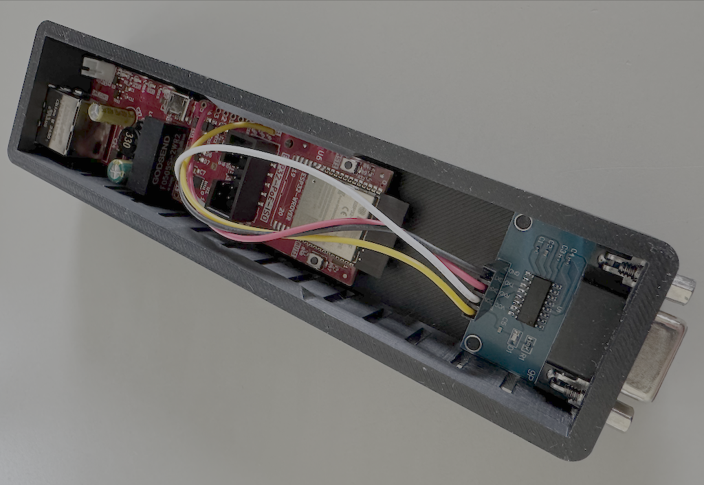

# 3d-prints

A collection of models for 3D printing different objects that have been useful to me.  

Some are pretty specific to my needs and will probably be of no interest to others.  
Some should be pretty generic and hopefully will be helpful to others.  

All the models have been made with [Cadova: Swift DSL for parametric 3D modeling](https://github.com/tomasf/Cadova),
but I also included the generated 3mf file so people without a Swift toolchain can benefit.  

# Models

## table-cap

A very specific item I made to attach the top of an old pedestal table to the base.  
In addition, I included a small edge so the bedside lamp would stay in the center of the table.  
I printed this on a BambuLab P1S with wood filament.  
I did not do any postprocessing and the result looks very much like brown plastic and not wood.  

## unifi-network-adapter-support

A support for attaching a [UniFi 5G Ethernet Adapter](https://eu.store.ui.com/eu/en/category/accessories-cables-dacs/collections/pro-store-ethernet-adapter/products/uacc-adapter-rj45-usbc-5ge?variant=uacc-adapter-rj45-usbc-5ge) to a [Neomounts DS75-450BL2](https://www.neomounts.com/desk/monitor-arms/ds75-450bl2-neomounts-ds75-450bl2-monitor-arm-17-32-gas-sprin/) monitor arm.

## Olimex enclosures

In my home automation setup, based on [Home Assistant](https://www.home-assistant.io), I use several [ESPHome](https://esphome.io) connected sensors.  
Those run great on ESP32 devices and I often find it convenient to power them using PoE.
For that, I use the [Olimex ESP32-POE-ISO](https://www.olimex.com/Products/IoT/ESP32/ESP32-POE-ISO/open-source-hardware) board.

So I wanted to design an enclosure for that board and whatever additional required hardware. I got inspiration from [Olimex ESP32 POE ISO Case](https://www.printables.com/model/264188-olimex-esp32-poe-iso-case) but re-designed everything in Swift using Cadova.

### olimex-esp32-minixlr

This version includes a mini-XLR connector for connecting an external sensor to the board.

### olimex-esp32-rs232

This version includes a DB-9 connector and enough room for a [MAX3232 adapter](https://nl.aliexpress.com/item/696400942.html) board for connecting to an RS-232 device.

